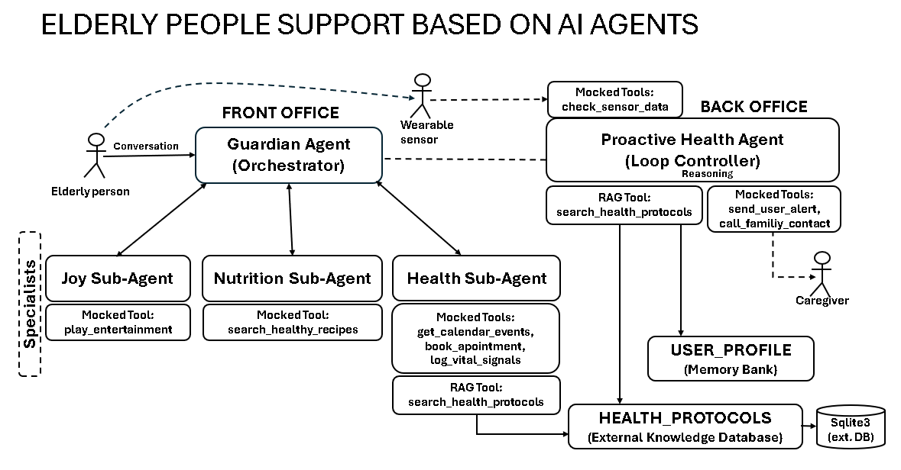

# 🛡️ Elderly People Support Based on AI Agents
Author: Eduardo Seiti Ito

Track: Agents for Good

Goal: A multi-agent system for elderly care support.

Course: 5-Day AI Intensive Course with Google/Kaggle

### 🤔 The Problem

Many elderly individuals wish to live independently but face significant challenges in managing the complex logistics of modern life. This includes remembering medications, scheduling doctor appointments, coordinating proper nutrition, and combating social isolation. Furthermore, a reactive system isn't enough; families need peace of mind that proactive monitoring is in place to handle unexpected health events, which are often full of uncertainty.

### ✅ The Solution: The Guardian Agent System

Herein is proposed the "Guardian Agent System", a proactive, multi-agent AI assistant. The system operates in two parts:

- ✨ **Conversational Assistant** - A friendly "Guardian" orchestrator agent that understands a senior's natural language requests (e.g., "I'm hungry," "When is my doctor's visit?") and delegates tasks to a team of specialists (HealthMinder, NutritionPal, JoyConnect).

- ✨ **Proactive Monitor** - A "ProactiveHealth" loop agent that runs 24/7, simulating sensor data (like blood pressure). When it detects an anomaly, it uses a RAG-based tool to semantically query a health protocol database, understand the uncertainty, and decide on the safest course of action—from a simple "drink water" alert to "call family."

This project intends to demonstrate a robust, personalized system that moves beyond simple task-completion to provide a true safety and support net.

### 🏗️ Guardian Agent System Architecture 

The Guardian Multi-Agent System architecture is displayed below:

And, the following concepts are introduced.

1. **Multi-Agent System**: The architecture cleanly separates concerns between a Guardian orchestrator (for user-facing tasks) and a ProactiveHealth agent (for background monitoring), which talk to specialists.

2. **Tools**: The system uses a wide array of the following tools: set_medication_reminder, check_sensor_data, send_user_alert.

   **Custom tools**: set_medication_reminder, check_sensor_data, send_user_alert.

   **OpenAPI-style**: Calendar mock (for production is recommended: Google Calendar).

   **RAG Tool**: The search_health_protocols tool is a perfect example of providing context for an LLM to "semantically search" and reason over.

3. **Loop Agents (and MCP)**: The ProactiveHealth agent is a loop agent that runs 24/7. It uses the Model-Controller-Program pattern to handle complex, uncertain health data, moving from sensor reading -> to protocol retrieval -> to reasoned action.

### 🎯 Value Proposition
The Guardian System solves the problem of information overload by serving as a central intelligence layer. It ensures **safety** (via immediate vital sign protocols) and **personalization** (via direct access to user preferences and schedules).

### 🛠️ Technology Stack
| Component | Function | Status |
| :--- | :--- | :--- |
| **Framework** | Google ADK (Agent Development Kit) | Core Architecture |
| **LLM** | Gemini 2.5 Flash for {Orchestrator} and {Specialists} | Reasoning Engine |
| **Architecture** | Hierarchical Delegation (Orchestrator -> Sub-Agents) | Final Design |
| **Execution Pattern** | Local Sub-Agents (In-Process) | Stable Solution |